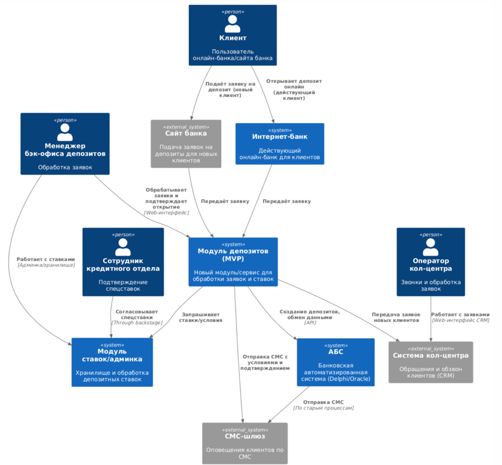
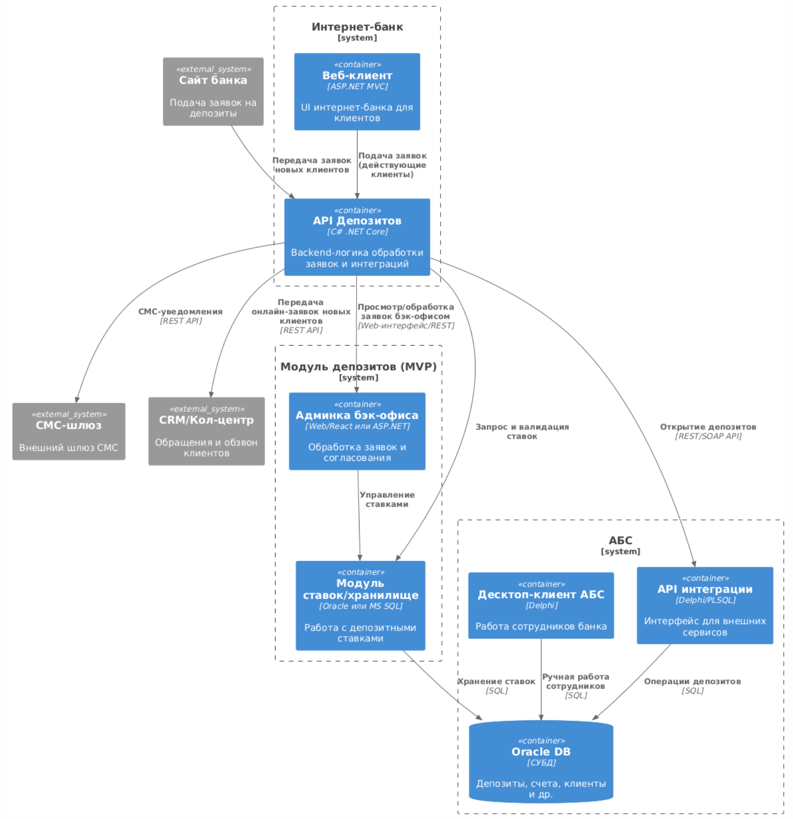

# Задание 3. Открытие депозитов онлайн
### **Название задачи:** MVP цифрового открытия депозитов и накопительных счетов в интернет-банке и на сайте банка «Стандарт»

### **Автор:** ФИО/Должность

### **Дата:** 22.05.2025

### **Функциональные требования**
| **№** | **Действующие лица или системы**     | **Use Case**                           | **Описание**                                                                                   |     |
| :---: | :----------------------------------- | :------------------------------------- | :--------------------------------------------------------------------------------------------- | --- |
|   1   | Клиент (пользователь интернет-банка) | Просмотр актуальных депозитов и ставок | Пользователь заходит в интернет-банк/на сайт, видит перечень вкладов и индивидуальные ставки   |     |
|   2   | Клиент (пользователь интернет-банка) | Подача заявки на открытие депозита     | Выбирает продукт, указывает счет-источник, сумму, подтверждает заявку через СМС                |     |
|   3   | Менеджер бэк-офиса депозитов         | Обработка онлайн-заявки                | Получает заявку, проверяет условия, подтверждает/корректирует в АБС, инициирует открытие       |     |
|   4   | АБС                                  | Открытие депозита                      | Регистрирует депозит в учете банка, проставляет согласованную ставку, формирует договор        |     |
|   5   | АБС + СМС-шлюз                       | Уведомление клиента                    | После подтверждения/открытия депозита отправляет СМС с параметрами вклада                      |     |
|   6   | Клиент (через сайт)                  | Подача заявки на вклад (новый клиент)  | Вводит ФИО и телефон, заявка поступает в кол-центр, дальше — звонок, приглашение в отделение   |     |
|   7   | Менеджер кол-центра                  | Обработка заявки с сайта               | Получает заявку, связывается с клиентом, разъясняет условия, инициирует дальнейший процесс     |     |
|   8   | Менеджеры кредитного отдела          | Консультация по специальным ставкам    | (по необходимости) по запросу обрабатывают индивидуальный риск клиента для внесения спецставки |     |

### **Нефункциональные требования**
| **№** | **Требование**                                                                                              |     |
| :---: | :---------------------------------------------------------------------------------------------------------- | --- |
|   1   | Защита передачи данных: сайт и интернет-банк должны работать по HTTPS/TLS, включая API и взаимодействия     |     |
|   2   | Централизованное хранилище ставок депозитов (отказ от Excel), доступ програмно и ручными правами            |     |
|   3   | Операции подтверждаются только существующими механизмами СМС, не изменяя ядро СМС-сервиса                   |     |
|   4   | Автоматизация интеграций без прямого доступа интернет-банка к БД АБС                                        |     |
|   5   | Среднее время ответа интерфейса < 300 мс; SLA доступности 99,9%                                             |     |
|   6   | Логирование всех пользовательских действий и аудиторских операций                                           |     |
|   7   | Использование только тех технологий, по которым есть внутренняя экспертиза (C#, .NET, Oracle, MS SQL, Java) |     |
|   8   | Масштабируемость новых модулей горизонтально (интернет-банк), вертикально (АБС)                             |     |
|   9   | Автоматизированная документация на новые API                                                                |     |
|  10   | Модулярность решения: "Депозиты" можно вынести в отдельный сервис/микросервис                               |     |

### **Решение**
#### Диаграмма контекста (C4 — Context):
- **Основные системы:**
    - Клиент: интернет-банк (существующая система, .NET), сайт (PHP/React)
    - Новый сервис "Подписка на депозиты" (создается на уже используемом стеке)
    - АБС (Delphi, Oracle)
    - СМС-шлюз банка (внешнее API)
    - CRM/кол-центр (Java, React, подрядчика)
- **Взаимодействия:**
    - Пользователь инициирует процесс из интернет-банка/сайта –> заявка попадает в новый сервис заявок
    - Новый сервис интегрирован с АБС через отдельное API/процедуру (БЕЗ прямого подключения к БД!)
    - Бэк-офис обрабатывает заявку в UI/админке, подтверждает открытие депозита, условия -> инициирует запись в АБС
    - После открытия депозита АБС инициирует отправку СМС через существующий шлюз (интеграция остается прежней)
    - Для новых клиентов с сайта — заявка поступает в CRM кол-центра, дальше — звонок, затем оформление по прежней схеме
    - Новое хранилище ставок, доступное обеим частям бэк-офиса, а также сервису заявок (Модуль в Oracle/MS SQL)

[C4_Context.puml](C4_Context.puml)

#### Диаграмма контейнеров (C4 — Containers):
- **Сервисы интернет-банка:**
    - UI/Веб-клиент (ASP.NET MVC): отображение вкладов, интерфейс подачи заявки
    - API депозитов (новый контейнер, C# .NET Core): принимает заявки, валидирует, пишет в БД/отправляет в очередь
    - Storage модуль ставок (модуль в Oracle/MS SQL), ручное управление ставками через UI-админку
- **АБС:**
    - API интеграции (Delphi, PL/SQL): операции по счетам, создание депозитов, установка ставки
    - СМС-клиент — формирует уведомления по факту открытия депозита
- **CRM/Кол-центр:**
    - Обработка заявок с сайта по API; связь с клиентом через звонок; при успехе — инициирует процедуру открытия депозита в АБС

[C4_Container.puml](C4_Container.puml)

#### Обоснование архитектурных решений:
- Разделение новых сервисов (депозиты/заявки/ставки) с минимальным вмешательством в старый монолит интернет-банка для снижения риска и увеличения гибкости.
- Все интеграции строятся на уровне API, очередей (например, REST+JSON или EventBus, если потребуется очередность), никаких прямых подключений к базам.
- Использование существующего ПО, где это возможно (MS SQL, Oracle, C#, Java), чтобы быстро обучить/поддерживать систему.
- Централизация кей-логики ставок для обоих бэк-офисов и frontend — заложить основу для будущей полной автоматизации.
- СМС-интеграция не требует вмешательства в ядро: используется существующий шлюз, вся логика инициируется напрямую из АБС.
- Допускается реализация UI админки ставок как лёгкого веб-клиента на существующем стеке (например, React или ASP.NET).

### **Альтернативы**  
1. Реализовать автоматизацию полностью на базе имеющейся АБС (монолит, доработка через PL/SQL и Delphi).
    - **Плюсы:**: Не нужно новых интеграций и сервисов.
    - **Минусы:**: Повышенная нагрузка, невозможность горизонтального масштабирования, задержки с обновлением.
2. Использовать сторонний конструктор заявок либо low-code платформу.
    - **Плюсы:**: Быстро для прототипа.
    - **Минусы:**: Нет глубокой интеграции с банковскими системами, дорогое сопровождение, проблемы с безопасностью/ПД.
3. Выносить всё в микросервисы с событийной моделью (Kafka/шина событий).
    - **Плюсы:**: FutureProof-архитектура.
    - **Минусы:**: MVP-старт затянется, нет экспертизы, интеграция с существующим интернет-банком невозможна в краткие сроки.
  
**Недостатки, ограничения, риски**:
- Ограниченная скорость внедрения для полного digital onboarding новых клиентов — требуется ручная идентификация.
- Уровень автоматизации АБС ограничен её архитектурой: горизонтальное масштабирование исключено, новые сервисы должны быть асинхронны.
- Возможны сложности с консистентностью ставок при ручном управлении (пока не реализована полная автоматизация).
- Необходимо предусмотреть двустороннюю аудит и журналирование операций для соответствия требованиям регулирования и аудита.
- Сложности интеграции: возможны “бутылочные горлышки” на стороне АБС, потребуется постоянное участие IT-отдела при тиражировании решений.
- UX MVP может остаться далёк от best-in-class до полной перехода на digital-only процессы.
