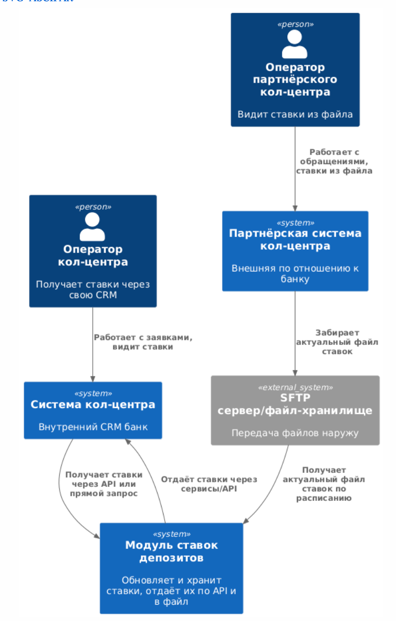
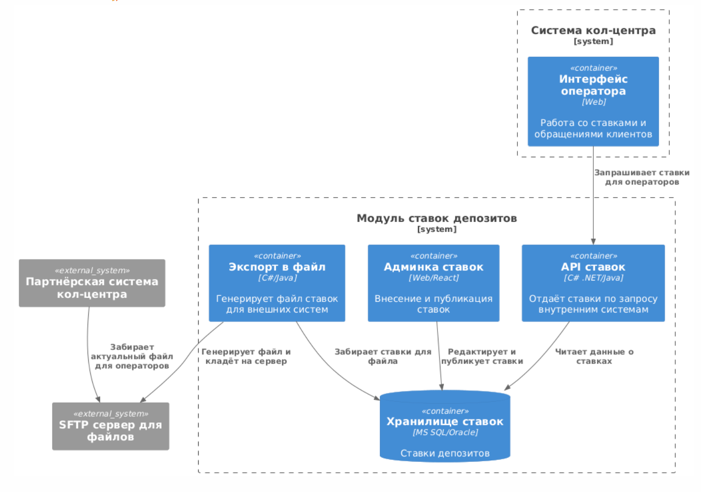

### **Название задачи:** Реализация доступа к актуальным ставкам по депозитам для всех операторов кол-центра, включая партнёра, в рамках MVP депозита

### **Автор:** Команда цифровой трансформации/Архитектор проекта

### **Дата:** 22.05.2025

### **Функциональные требования**
| **№** | **Действующие лица или системы**        | **Use Case**                                  | **Описание**                                                                     |     |
| :---: | :-------------------------------------- | :-------------------------------------------- | :------------------------------------------------------------------------------- | --- |
|   1   | Оператор кол-центра банка               | Получить актуальную ставку по депозиту        | В интерфейсе кол-центра видеть актуальные ставки по продуктам                    |     |
|   2   | Система кол-центра                      | Обновлять ставки банка автоматически          | Получать актуальные ставки через интеграцию из банка                             |     |
|   3   | Оператор партнерского кол-центра        | Получить актуальные ставки по депозиту        | В интерфейсе видеть последние ставки, полученные из банка                        |     |
|   4   | Внешняя система партнёрского кол-центра | Получать ставки в виде файла                  | Получать файл (CSV/XLSX) ставок из банка удобным для загрузки способом (без API) |     |
|   5   | Бэк-офис депозитов                      | Актуализировать ставки (ручной ввод и правки) | Вносить изменения и быстро публиковать их для всех каналов                       |     |
|   6   | Система банка                           | Экспортировать ставки в файл для партнёра     | По расписанию формировать файл и выкладывать его на файл-хранилище/SFTP          |     |

### **Нефункциональные требования**
| **№** | **Требование**                                                                                   |     |
| :---: | :----------------------------------------------------------------------------------------------- | --- |
|   1   | Время обновления ставок в интерфейсе кол-центрa — не более 5 минут от внесения изменений         |     |
|   2   | Передача файла с актуальными ставками партнёру — не реже, чем раз в 15 минут (или по расписанию) |     |
|   3   | Файл с партнёру передается в защищённой среде (SFTP/FTPS, без API), стандарт таблицы (CSV/XLSX)  |     |
|   4   | Доступ к ставкам есть только у авторизованных операторов через внутренние сервисы                |     |
|   5   | Использование технологий и интеграций, поддерживаемых банком (MS SQL/Oracle, C#, SFTP и др.)     |     |
|   6   | Все изменения ставок должны логироваться                                                         |     |
|   7   | Решение не должно влиять на производительность АБС                                               |     |
|   8   | Формат файла с партнёру должен быть универсальным (без лишних данных) и удобным для обработки    |     |

### **Решение**  

#### Диаграмма контекста (C4-Context, PlantUML):

[C4_Context.puml](C4_Context.puml)

#### Диаграмма компонентов (C4-Container, PlantUML):

[C4_Container.puml](C4_Container.puml)

#### Краткое описание логики решений
- Требуется минимально модифицировать текущий модуль ставок: добавить экспорт в SFTP-файл (триггер по расписанию), согласованный формат; оператор партнёра получает только файл, не API.
- Для своего кол-центра — интеграция с «модулем ставок» напрямую (REST API, MS SQL view), обновление ставок не реже чем раз в 5 минут (по кешу).
- Основное хранилище ставок — БД банка (MS SQL/Oracle, право только админке и сервисам).
- Правки в админке ставок отражаются мгновенно для внутренних операторов, и в течение 5–15 минут — для партнёров.
- Все операции логируются для аудита.
- 
### **Альтернативы**
|                                    **Альтернатива**                                    | **Плюсы**                                      | **Минусы**                                                   |
| :------------------------------------------------------------------------------------: | :--------------------------------------------- | ------------------------------------------------------------ |
|                         Отдать партнёру API-доступ (REST/SOAP)                         | Самая быстрая выгрузка, без ручных файлов      | Не реализуемо — такая возможность исключена (без API)        |
|                          Передавать ставки партнёру по e-mail                          | Просто реализуется, нет специфичных требований | Нужно вручную выгружать и отправлять, риск потери контроля   |
| Хранить отдельную Excel-таблицу ставок и делиться через облако (Google Drive/OneDrive) | Быстро для пилота                              | Низкая защищенность, нет логов изменений, проблемы ИБ        |
|                  Дублировать ставки в системе партнёрского кол-центра                  | Нет интеграции, автономность                   | Потеря синхронизации, ручное обновление, высокий риск ошибок |
  
**Недостатки, ограничения, риски**:
- При скачивании файла партнёром актуальность ставок зависит от частоты экспорта и процедур партнёра (между изменением и загрузкой может пройти некоторое время).
- При необходимости экстренного информирования операторов приходится связываться дополнительно.
- Требуется строгая дисциплина обновления файла, логирование всех изменений, резервное хранение всех выгруженных файлов для аудита.
- Файл на SFTP может быть не синхронизирован, если возник сбой коммуникации/диска — нужен мониторинг успешности выгрузки и загрузки.
- Любые доработки доступа к ставкам в кол-центре могут потребовать дополнительной интеграции (больше нагрузки на поддержку).
- Открытие ставок для внешних систем требует юридических и ИБ-согласований о формате и составе передаваемых данных.

## Крупные задачи по изменениям в системах

**Модуль ставок банка:**
- Доработка UI админки (массовое/быстрое обновление ставок по продуктам)
- Добавление/расширение API для внутреннего использования кол-центром
- Разработка модуля экспорта файлов ставок (CSV/XLSX) по расписанию
- Организация безопасного файлового обмена (SFTP/FTPS) с внешним сервером
- Аудит доступа и логирование операций с файлами

**Система кол-центра банка:**
- Разработка/подключение интеграции с API ставок банка
- Отображение актуальных ставок оператору в рабочем интерфейсе
- Логика обновления кэша ставок при изменении

**Система партнёрского кол-центра:**
- Получение файла ставок с SFTP, импорт в свою систему
- Отображение актуальных ставок оператору

**Инфраструктура/DevOps:**
- Настройка, тестирование и сопровождение SFTP сервера
- Настройка мониторинга выгрузки файлов и их доступности партнёру

## Пример последовательного RoadMap MVP (6 месяцев)

**Месяц 1–2:**
- Анализ, проектирование схемы ставок, утверждение формата файла
- Разработка доработок админки ставок, API, системы выгрузки файла

**Месяц 3:**
- Внедрение API в системе кол-центра банка
- Организация безопасного SFTP-хранилища для файлов ставок

**Месяц 3–4:**
- Тестирование, настройка кэширования, оптимизация бизнес-процессов
- Первая интеграция и пилотный запуск обмена файлами с партнёром

**Месяц 5:**
- Настройка мониторинга/аварийных процедур, обучение операторов
- Внедрение логирования/аудита операций со ставками и файлами

**Месяц 6:**
- Полномасштабный запуск обмена файлами
- Сбор обратной связи, корректировка схемы на основании реальных ошибок

**Целевое состояние через год**
- Перевод всех channel’ов банка и партнеров на единую централизованную систему ставок
- Автоматическая синхронизация ставок не только файлами, но и по защищённым интеграциям (если появится возможность)
- Масштабирование схемы на другие продукты (например, кредиты)
